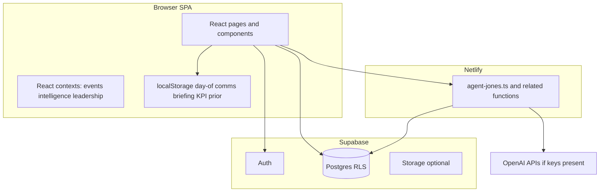

# CampaignOS — system handoff, map, and blueprint

> **For the next AI thread (read this block first)**  
> 1. **Repo:** `CampaignOS` (Vite + React 19 + React Router 7 + Supabase JS). Netlify Functions host `agent-jones` and related APIs.  
> 2. **Branch context:** Confirm current branch (`git status`); primary remote is `origin` → `https://github.com/Grappe501/CampaignOS.git`.  
> 3. **Do not assume migrations are applied remotely:** local `npm run db:list` only **lists** SQL files; applying them requires Supabase CLI (`supabase db push` / linked project) or SQL run in Supabase Dashboard — see [Database migrations](#database-migrations) below.  
> 4. **Health checks:** `npm run verify` (eslint + production build) is the main CI-like gate. `npm run check:env` validates `.env`. Strict `tsc --noEmit` may still report legacy issues outside new work — track separately.  
> 5. **Product direction:** Treat this codebase as an **operational campaign OS**: voter/contact graph (Power5), events/command/war-room, volunteer command + marketplace, leadership briefing, Agent Jones (advisory, server-validated). User wants **throughput**: every surface should connect to data and next actions — **fill empty spaces** between desks, don’t add orphan UIs.  
> 6. **When editing:** Match existing patterns in `src/lib/` and `src/styles/app-layout.css`; avoid drive-by refactors; keep AI prompts bounded and server-validated in `netlify/functions/agent-jones.ts`.  
> 7. **Artifacts:** `reports/audit-build-latest.md` is generated by `node scripts/audit-build.mjs --skip-verify` (file tree + env snapshot). This file is the human narrative + roadmap.

---

## Document control

| Field | Value |
|--------|--------|
| **Package version** | **0.6.0** (`package.json` / root entries in `package-lock.json`) |
| **Last automated checks (local)** | `npm run db:list`, `npm run verify`, `npm run check:env`, `node scripts/audit-build.mjs --skip-verify --out reports/audit-build-latest.md` |
| **Supabase CLI** | Not required for frontend; was not on PATH in last environment — use Dashboard or install CLI to apply migrations |

---

## Executive summary

CampaignOS connects **identity and profile** (Supabase Auth + `campaign_profiles`) to **relational organizing** (Power5, propagation, comms), **program events** (calendar → record → staffing → comms → day-of → after-action), **volunteer operations** (tasks, command desk, opportunities, recommendations), and **AI assistance** (Agent Jones via Netlify, bounded JSON context). The **leadership briefing** (`/events/leadership`) is a deterministic, client-built executive layer fed into Agent Jones as `event_operations_executive` when the page is mounted.

**Strategic focus (user intent):** maximize **end-to-end throughput** — identify gaps where data exists but UX/RPC doesn’t complete the loop; wire **connectors** (deep links, shared contexts, same row IDs) between dashboard, coordinator desk, war room, event record, approvals, volunteer flows, and analytics.

---

## System map (architecture)

### Runtime layers



### Source layout (high level)

| Area | Path | Role |
|------|------|------|
| **App shell & routes** | `src/App.tsx` | Auth gate, route table, providers order |
| **Styles** | `src/styles/app-layout.css` | Single large design system (mobile-first, touch targets, Chris Jones brand vars `--cj-*`) |
| **Supabase client** | `src/lib/supabaseClient.ts` | Browser client |
| **Events domain** | `src/lib/campaign*`, `event*`, `multiEvent*`, `todayCommand*` | Events list, record, health, war room, leadership briefing |
| **Volunteer domain** | `src/lib/volunteer*`, `rapidAction*` | Marketplace, command, recommendations, orchestration |
| **Power5 / graph** | `src/lib/*power5*`, `power5DashboardHints` | Relational workspace |
| **Agent Jones** | `src/lib/agentJones*.ts`, `src/components/AgentJonesPanel.tsx`, `GlobalFloatingAgentJones.tsx` | Client context packing + UI; server completion in `netlify/functions/agent-jones.ts` |
| **API wrappers** | `src/lib/api/*.ts` | Typed fetch to Netlify or other endpoints |
| **Migrations** | `supabase/migrations/*.sql` | Schema evolution (lexicographic order = apply order) |

### Route inventory (authenticated unless noted)

| Route pattern | Purpose |
|----------------|---------|
| `/login` | Auth |
| `/`, `/dashboard` | Role home / dashboard workspace |
| `/candidate`, `/coordinator`, `/intern`, `/admin`, `/power5` | Role desks |
| `/events` | Event coordinator desk |
| `/events/calendar`, `/events/war-room`, `/events/leadership`, `/events/review-requests`, `/events/promotion`, `/events/analytics`, `/events/neighborhood`, `/events/county-ops` | Programs & leadership |
| `/events/:eventId`, `/events/:eventId/:detailSection` | Event record (command sections) |
| `/events/:eventId/checkin` | Check-in |
| `/volunteers/command`, `/volunteers/team-lead`, `/volunteers/me`, `/volunteers/opportunities` | Volunteer ops |
| `/ops/signup-sheets`, `/ops/signup-sheets/:batchId` | Signup sheet ingestion |

### Context providers (wiring)

- **`CampaignEventsProvider`** — campaign event list for desks and war room.
- **`EventIntelligenceLayerProvider`** — event intelligence registry for Agent Jones / panels.
- **`LeadershipExecutiveBriefingProvider`** — leadership snapshot + `agentPayload` for Agent Jones when `/events/leadership` is active (`LeadershipBriefingContent` sets briefing on mount).

### Data flow: events throughput (ideal loop)

1. **Create/plan** — calendar / record (`campaign_events` via loaders in `campaignEventsFromSupabase` etc.).  
2. **Staff** — assignments, heatmap, load balancer (`eventStaffing*`, `staffingCoverage*`, `volunteerLoadBalancer*`).  
3. **Govern** — approvals (`eventApprovalService`, review requests).  
4. **Promote** — Mobilize/comms pipeline (`eventCommunications*`, local workspace).  
5. **Execute** — day-of workspace (`eventDayOf*`, localStorage overlays).  
6. **Close** — after-action, outcomes, learning (`eventAfterAction*`, summaries).  
7. **Leadership** — `buildLeadershipBriefing` aggregates war room + command + KPI prior (browser).  

**Gaps to fill (blueprint):** any step without a clear **next link** or **shared ID** in UI reduces throughput; prioritize connectors (buttons, banners, Agent Jones route hints) over new standalone pages.

---

## Database migrations

- **Count:** 39 SQL files under `supabase/migrations/` (see `npm run db:list` for ordered list).  
- **Apply (pick one):**  
  - **Supabase CLI (recommended for dev teams):** `supabase link` then `supabase db push` (requires CLI + project ref).  
  - **Dashboard:** SQL editor — run files **in filename order** (timestamps).  
- **Local listing only:** `npm run db:list` does **not** execute SQL — it prints order.  
- **Config:** `supabase/config.toml` present for CLI projects.

---

## Scripts and tools

| Script | Purpose |
|--------|---------|
| `npm run verify` | `eslint .` + `vite build` |
| `npm run lint` | ESLint only |
| `npm run build` | Production bundle |
| `npm run dev` | Vite dev server |
| `npm run check:env` | Validate `.env` (requires `VITE_SUPABASE_URL`, `VITE_SUPABASE_ANON_KEY`) |
| `npm run setup:env` | Scaffold `.env` |
| `npm run db:list` | List migration filenames in apply order |
| `node scripts/audit-build.mjs` | Tree + optional verify + markdown report |
| `npm run handoff:chatgpt` | Generate ChatGPT handoff |
| `npm run netlify:env:push` | Push env to Netlify (token/site id needed) |

---

## UX, accessibility, and contrast (light UI)

- **Global shell** (`.app-viewport`) sets `color-scheme: light` and explicit `--text: #30323c` on `--bg: #fff` — **avoids OS dark-mode white-on-white accidents** for the main content.  
- **Top bar / brand strip** uses **white or near-white text** on **dark brand backgrounds** (`.app-topbar`, `--brand-bar`, buttons targeting dark chrome) — that is intentional.  
- **Risk areas to watch when theming:** placing `.btn-touch` or `color: #fff` text on **white** cards without overriding background; grep for `color: #fff` when adding new surfaces.  
- **Recommendation:** for new components, use `--text` / `--bg` / `subtitle` patterns from existing desk pages before introducing new neutrals.

---

## Agent Jones (policy)

- Client builds **bounded** `AgentJonesSafeContextV2`-style payloads (`agentJonesContextV2.ts`).  
- **Leadership:** `leadership_briefing_v1` / `event_operations_executive` validated in `agent-jones.ts`.  
- AI remains **advisory**; approvals and writes go through normal Supabase RPCs and RLS.  
- Keys: `OPENAI_*` must stay **server-side** — never `VITE_*`.

---

## Versioning and release

- **Semantic-ish versions:** `package.json` `version` field; git tags optional (`v0.6.0`).  
- **Before tagging:** run `npm run verify`; apply migrations to target Supabase project; smoke-test login, `/events`, one event record, Agent Jones panel.  
- **Netlify:** ensure env vars mirror `check:env` expectations for functions.

---

## Phases (suggested roadmap)

| Phase | Focus | Outcome |
|-------|--------|---------|
| **A — Solidify connectors** | Same IDs and links between dashboard ↔ desk ↔ war room ↔ record ↔ approvals | No dead-end screens |
| **B — Data completion loops** | Outcomes, follow-ups, comms recap, closure — surface completion % and next action | Throughput metrics visible |
| **C — Leadership + analytics** | Leadership briefing ↔ analytics page; trend truth from DB not only browser KPI prior | Executive trust |
| **D — Volunteer throughput** | Marketplace ↔ command ↔ assignments ↔ recommendations | End-to-end volunteer journey |
| **E — Hardening** | RLS audits, strict TS cleanup, chunk splitting, perf budgets | Production scale |

**Future blueprint (tie-together):** a single **“campaign operating picture”** API or materialized view that feeds dashboard tiles, leadership snapshot, and Agent Jones with **one** set of counts (today: multiple client aggregators — converge over time).

---

## Empty spaces / backlog (build list)

Non-exhaustive, prioritized by throughput:

1. **Single source of truth for KPIs** — leadership browser prior vs server history; align trend semantics.  
2. **War room → record** deep links already exist; ensure **every card** has route + section hash where applicable.  
3. **Volunteer marketplace → opportunity → task** handshake audit (`volunteerOpportunity*`, `VolunteerCommand*`).  
4. **Event intelligence layer** — ensure registry populated wherever event panels mount.  
5. **Signup sheet ops** — linkage to events and volunteer profiles (see migrations through `signup_sheet_ingestion`).  
6. **TypeScript:** project-wide `tsc` cleanup (large backlog; do in slices).  
7. **Code-splitting:** Vite warns on bundle size — route-based `lazy()` next refactor.

---

## Git hygiene (for humans / next session)

```bash
git status
git branch
npm run verify
# commit with conventional message; tag if releasing
git push -u origin <branch>
```

---

## Change log (this document)

- **Initial handoff:** System map, migration index, scripts, UX/contrast notes, roadmap, version bump in `package.json`.

---

*Generated as part of CampaignOS system check and documentation pass. Update this file when phases complete or architecture shifts materially.*
